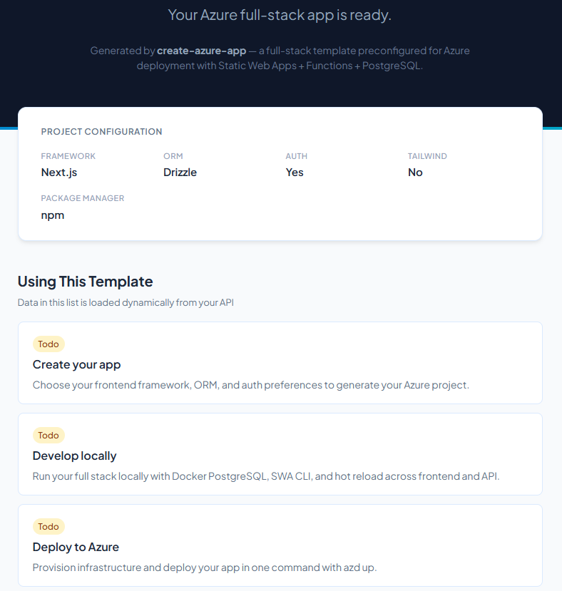

# create-azure-app

An interactive CLI that scaffolds a full-stack Azure web app, from a single command to full integrated Azure environment in minutes not hours.

Think **[create-next-app](https://nextjs.org/docs/app/api-reference/cli/create-next-app)** or **[create-t3-app](https://create.t3.gg/)**, but for Azure. Pick your frontend framework, ORM, and auth preference, and get a deployable project with infrastructure-as-code, local dev environment, and GitHub CI/CD baked in.

```
npx create-azure-app my-app
```


---

## Why?

Getting a full-stack app running on Azure shouldn't require stitching together a dozen services by hand. Vercel and Supabase made this easy - `create-azure-app` does the same for Azure.

### How it compares

| | create-azure-app | create-t3-app | create-next-app |
|---|---|---|---|
| **Cloud target** | Azure (SWA + Functions + optional PostgreSQL) | None (BYOH) | Vercel-optimized |
| **Infrastructure** | Full IaC (Bicep) + `azd up` | Not included | Not included |
| **Database** | PostgreSQL + Prisma/Drizzle (optional) | Prisma (optional) | Not included |
| **Auth** | Entra ID via SWA Easy Auth | NextAuth.js (optional) | Not included |
| **API layer** | Azure Functions (TypeScript) | tRPC (optional) | Next.js API routes |
| **Local dev** | SWA CLI + Docker Compose (when DB enabled) | Manual setup | `next dev` |
| **Deploy** | `azd up` (one command) | Manual | `vercel` or manual |
| **CI/CD** | GitHub Actions (OIDC) | Not included | Vercel built-in |
| **PR previews** | SWA preview environments | Not included | Vercel built-in |
| **Secrets** | Key Vault + Entra ID | Manual | Environment vars |
| **Framework choice** | Next.js, Vite+React, SvelteKit | Next.js only | Next.js only |

**create-t3-app** gives you a great app skeleton but leaves hosting, databases, and infrastructure to you. **create-next-app** is Next.js-only with no backend story. 

**create-azure-app** generates the entire stack — app code, API, database schema, infrastructure, and deployment config — ready for `azd up`.

---

## What you get

A generated project with this structure:

```
my-app/
├── .github/workflows/
│   ├── deploy.yml              # Build + deploy on push/PR (OIDC)
│   └── provision.yml           # Infrastructure provisioning (manual)
├── azure.yaml                  # AZD manifest — deploy with `azd up`
├── infra/
│   ├── main.bicep              # Root Bicep template
│   ├── main.parameters.json    # Parameter defaults
│   └── modules/
│       ├── swa.bicep           # Static Web App
│       ├── swa-appsettings.bicep # SWA app settings
│       ├── postgres.bicep      # PostgreSQL Flexible Server  (DB only)
│       ├── keyvault.bicep      # Key Vault for secrets       (DB only)
│       └── monitoring.bicep    # Application Insights
├── src/
│   ├── web/                    # Frontend (Next.js | Vite+React | SvelteKit)
│   └── api/                    # Azure Functions v4 (TypeScript)
│       └── src/
│           ├── functions/      # HTTP endpoints (health + CRUD)
│           └── lib/
│               ├── db.ts       # ORM client (Prisma or Drizzle)  (DB only)
│               └── auth.ts     # SWA Easy Auth helper
├── db/                         # (DB only)
│   ├── schema.prisma           # Database schema (or Drizzle equivalent)
│   ├── seed.ts                 # Seed script with sample data
│   └── migrations/
├── docker-compose.yml          # Local PostgreSQL               (DB only)
├── swa-cli.config.json         # SWA CLI dev config
├── staticwebapp.config.json    # Auth routes + SPA fallback
├── scripts/
│   ├── migrate.sh              # DB migration hook (Linux/macOS) (DB only)
│   └── migrate.ps1             # DB migration hook (Windows)     (DB only)
└── .env.example
```



### Azure services used

| Service | Purpose | Dev-tier cost |
|---|---|---|
| **Static Web Apps** | Frontend hosting, CDN, PR previews, managed Functions | $9/mo (Standard SKU) |
| **Azure Functions** | TypeScript API layer (HTTP triggers) | Included with SWA Standard |
| **PostgreSQL Flexible Server** | Managed database with Entra ID auth *(optional)* | ~$12-15/mo (Burstable B1ms) |
| **Application Insights** | Monitoring and logging | Minimal cost |
| **Key Vault** | Secret management *(optional, database only)* | Minimal cost |

---

## Quick start

### Prerequisites

- [Node.js](https://nodejs.org/) 20+
- [Azure Developer CLI (azd)](https://aka.ms/azd)
- [Docker](https://www.docker.com/) (optional, only required when DB is included)
- [GitHub CLI (gh)](https://cli.github.com/) (optional, for CI/CD setup)

> **Note:** SWA CLI and Azure Functions Core Tools are installed as project dev dependencies — no global install needed.

### Step 1 - Create your app

```bash
npx create-azure-app my-app
```

You'll be prompted to choose:

| Option | Choices | Default |
|---|---|---|
| Frontend framework | Next.js, Vite + React, SvelteKit | Next.js |
| Database | Yes / No | Yes |
| ORM | Prisma, Drizzle | Prisma |
| Authentication | Yes (Entra ID) / No | Yes |
| Tailwind CSS | Yes / No | No |
| Package manager | npm, pnpm, yarn | npm |

> **Note:** The ORM option only appears when database is enabled. When skipped, the API returns in-memory mock data and no PostgreSQL or Docker Compose is included.

### Step 2 - Develop locally

```bash
cd my-app
npm run setup    # Install all deps (+ start Postgres, migrate, seed if DB enabled)
npm run dev      # SWA CLI on http://localhost:4280
```

The SWA CLI proxies everything through a single port:
- **Frontend** → framework dev server (hot reload)
- **API** → Azure Functions (http://localhost:7071)
- **Auth** → SWA auth emulator

### Step 3 - Deploy to Azure

```bash
azd auth login
azd up           # Provision infrastructure + deploy app
```

Your app is live with:
- Static Web App serving the frontend via CDN
- Azure Functions handling API requests
- PostgreSQL Flexible Server with your schema migrated *(if DB enabled)*
- Key Vault storing `DATABASE_URL` *(if DB enabled)*
- Application Insights collecting telemetry

### Step 4 - Set up CI/CD

```bash
# Push your code to GitHub
git remote add origin https://github.com/YOU/my-app.git
git push -u origin main

# Configure OIDC + GitHub variables (one-time)
azd pipeline config --provider github --auth-type federated
```

`azd pipeline config` creates a service principal with federated credentials and
stores `AZURE_CLIENT_ID`, `AZURE_TENANT_ID`, `AZURE_SUBSCRIPTION_ID`,
`AZURE_ENV_NAME`, and `AZURE_LOCATION` as GitHub repository variables.

After this, every push to `main` auto-deploys, and every PR gets a preview URL.

### Tear down

```bash
azd down         # Remove all Azure resources
```

---

## Options in detail

### Frontend frameworks

**Next.js** (default) — App Router with static export. Pages are pre-rendered and served from SWA's CDN. API routes are handled by Azure Functions, not Next.js API routes.

**Vite + React** — React 19 with Vite 6. Fast HMR, static build output.

**SvelteKit** — SvelteKit 2 with static adapter. Compiled to static files for SWA.

### Database

When enabled, the generated app includes a PostgreSQL schema, seed data, migration scripts, a Docker Compose file for local development, and Bicep modules for Azure PostgreSQL Flexible Server and Key Vault.

When disabled, the API returns in-memory mock data and no database infrastructure is provisioned.

### ORMs

Only relevant when database is enabled.

**Prisma** (default) — Schema-first ORM with auto-generated TypeScript client. The generated API endpoints use Prisma for all database operations (CRUD on Items + Users). Migrations via `prisma migrate`.

**Drizzle** — Lightweight, SQL-like ORM with zero codegen. Same generated CRUD endpoints wired up with Drizzle queries. Migrations via `drizzle-kit`.

### Authentication

When enabled, the generated app includes:
- `staticwebapp.config.json` with route guards and Entra ID login/logout routes
- API middleware that reads the `x-ms-client-principal` header injected by SWA
- Frontend auth utilities for checking login state

SWA Easy Auth supports Microsoft Entra ID, GitHub, and custom OIDC providers — no auth code to write or maintain.

---

## Available scripts

After scaffolding, your project includes these root-level scripts:

| Script | Description |
|---|---|
| `npm run setup` | Install root + sub-project deps (+ start Docker Postgres, migrate, seed when DB enabled) |
| `npm run dev` | Start SWA CLI (frontend + API + auth on :4280) |
| `npm run build` | Build frontend and API |
| `npm run dev:web` | Start frontend dev server only |
| `npm run dev:api` | Start Azure Functions only |
| `npm run db:migrate` | Run database migrations *(DB only)* |
| `npm run db:seed` | Seed the database *(DB only)* |
| `npm run db:push` | Push schema changes without a migration file *(DB only)* |
| `npm run install:web` | Install frontend sub-project dependencies |
| `npm run install:api` | Install API sub-project dependencies |

---

## How it works

`create-azure-app` uses a **composable feature system**. Each feature (frontend framework, ORM, auth, infrastructure) is an independent module that contributes files, dependencies, and scripts. Features are composed together, with later features overriding earlier ones for the same file paths.

This means:
- The **API feature** generates starter endpoints with an in-memory data store
- The **database feature** replaces those with real ORM-backed implementations
- The **auth feature** adds route guards and auth helpers on top
- The **infra feature** adds Bicep modules, Key Vault wiring, and `azure.yaml` for deployment
- The **CI/CD feature** generates GitHub Actions workflows with OIDC authentication

---

## Contributing

This project is in active development. Contributions welcome — open an issue or PR.

## License

MIT
